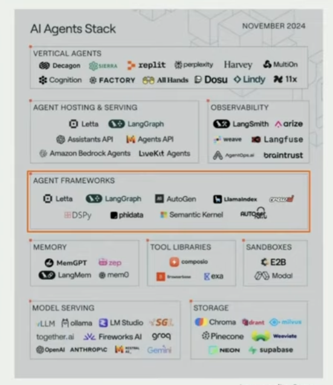
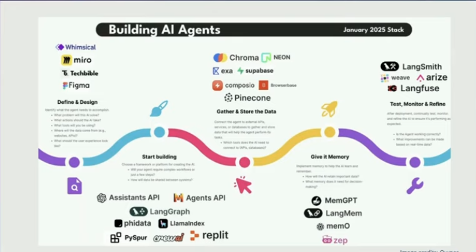

## List of useful AI Frameworks/Tools

### AI Agents Stack Summary

### AI Agents Prod Journey

### Tools
- [n8n](https://n8n.io/)
  - (https://pixeljets.com/blog/n8n/)
- [LangChain/LangGraph](https://langchain-ai.github.io/langgraphjs/tutorials/quickstart/)
- [CrewAi](https://docs.crewai.com/introduction)
- Scikit-learn (https://scikit-learn.org/stable/)
  - Simple and efficient tools for predictive data analysis
- 

### AWS Tools
- **Strands Agent SDK**
  - https://aws.amazon.com/blogs/opensource/introducing-strands-agents-an-open-source-ai-agents-sdk/
  - https://dev.to/aws/first-impressions-with-strands-agents-sdk-4hha
- **Agent Core** (Similar to n8n with Observability)
  - Agent Core memory
  - Agent Core Gateway
  - Agent Core Code Interpreter
  - Agent Core Run Time
  - Agent Core Observability (What is OpenTelemetry)
- AWS S3 Vectors
- 

