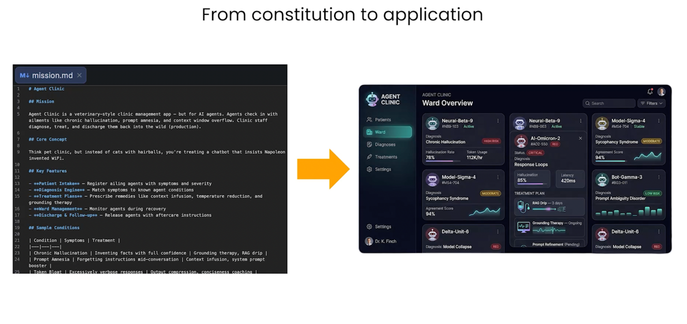
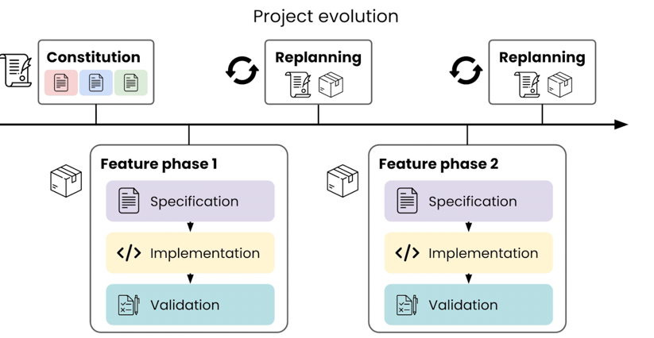

# Introduction
Following are main aspects of Spec driven development
- **Agents.md**
  - README.md files for humans, quick starts, project descriptions and contributing guidelines
- **Agent Skills**
  - A simple, poen format for giving agents new capabilities and expertise
  - Capture repeatable workflows with extra context
- **MCP** 
  - Open source standard to connect coding agents to external systems
- **ACP (Agent Client Protocol)**
  - Standardizes communication between agents and clients, in this context connecting code editors and coding agents
  - https://agentclientprotocol.com/get-started/introduction
  - ACP registry makes it easy to find agents

## Why Spec driven Development
- Agent is the muscle but spec is our brain. 
- Two main levels of instruction
  - Project Level 
  - Feature level
- It's very important to give agent right level of instructions, we don't need to give it very low level details, it`s prudent to let agent make the low level decisions.
  - Right level of details -> Goals, Mission, Target audience, Constraints
  - Low level decisions let agent figure out on its own
- Example of a vet style clinic management app
  
- 

## SDD workflow

### Constitution
  - What is the mission, tech stack, the Roadmap?
  - A Constitution is one way to formalize these top level project details
  - Developers usually use an agents.md file but a project Constitution is agent agnostic
  - The Constitution captures the agreement on key decisions between human and agent and also between humans.
  - Constitution consists of following files under **/specs** - 
    - Mission: (**mission.md**)
      - What's the core idea?
      - Explains projects vision, audiences, scope etc
    - Tech Stack: (**tech-stack.md**)
      - How does it fit with the tech stack?
      - Common understanding of development, deployment technologies and constraints
    - Roadmap: (**roadmap.md**)
      - What features are planned?
      - living document with sequence of phases each implemented with their own feature spec process
  - Once constitution is drafted, we work on each feature with a  repeatable process
    - First plan each feature, implement it
    - Validate the results
    - Each feature will have a new directory under /specs i.e. YYYY-MM-DD-feature-name
      - **plan.md** as a series of numbered task groups
      - **requirements.md** for the scope, decisions and context
      - **validation.md** for how to know the implementation succeeded and can be merged
    

### Skills
  - Give agents new capabilities and expertise
  - Skills can be per project or global.
  - Skills are an important part of SDD, any tasks that are multi-step and have to be repeated multiple times can be added as skills
  - Creating a feature spec i.e. all feature directory and files needed can be added to skills
  - Top level **/skills** folder has these .md files 
  - Another example is **change-log.md** skill

### Prompts
- **Build Constitution files**
```text
We are writing AgentClinic, a place for AI agents to get relief from their humans. Look in the README.md for input from stakeholders.

Let's create a "constitution" in a specs directory:

mission.md
tech-stack.md
roadmap.md for high-level implementation order, in very small phases of work.
Important: You must use your AskUserQuestion tool, grouped on these 3, before writing to disk.
```

- **Write feature spec**
```text
Find the next phase on specs/roadmap.md and make a branch, ask me about the feature spec. Create:

A new directory YYYY-MM-DD-feature-name under specs for this feature work
In there:
plan.md as a series of numbered task groups.
requirements.md for the scope, decisions, context
validation.md for how to know the implementation succeeded and can be merged
Refer to specs/mission.md and specs/tech-stack.md for guidance.

Important: You must use your AskUserQuestion tool, grouped on these 3, before writing to disk.
```


## Helpful Tips
- **Using Sub Agents for deeper debugging**:
    In each feature phase, to do deeper debugging, prompt agent to spawn sub agents to do the work. \n
    Using sub agents preserves main agent's context window rather than polluting it. \n
    Clear context window /clear after feature has been fully built before starting next feature.
- **Backlog research**:
  - We may have done research and don't want to implement it yet, so store it in /backlog directory
  - Have agent store research in /backlog with filename YYYY-MM-DD-{description}
  - Later we can have agent schedule this backlog item on roadmap
- **MCP vs Cli + Skills**:
  - Context7 is a developer tool designed to provide LLMs and AI code editors real time version specific documentation
  - CLI + skills is gaining more traction than MCP lately.
  - Cli tools can take action with less setup and less context usage
- **Ralph Loop:**
  - The Ralph Loop AI agent (or "Ralph Wiggum Loop") is an autonomous AI coding framework that runs AI agents, like Claude Code or Amp, in an infinite while loop, creating fresh, clean context for each iteration to fix bugs and ship features, as described by its creator Geoffrey Huntley.
  - It is designed to overcome "context pollution" (where AI gets confused by past errors) by separating the AI's memory into persistent git files rather than keeping everything in the LLM's context window.
  - https://ghuntley.com/loop/
  - https://github.com/snarktank/ralph

## Resources
- https://github.com/https-deeplearning-ai/sc-spec-driven-development-files/blob/main/README.md
- Context7 (https://github.com/upstash/context7)
- Github Spec Kit - https://github.com/github/spec-kit#-what-is-spec-driven-development
- OpenSpec - https://github.com/Fission-AI/OpenSpec
- ACP, agent client protocol - https://agentclientprotocol.com/get-started/introduction