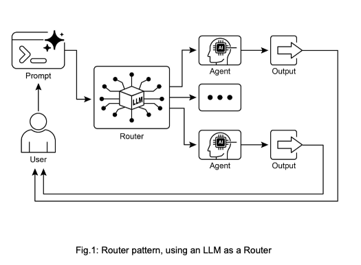
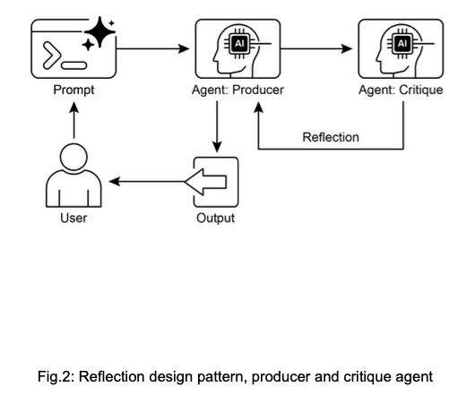
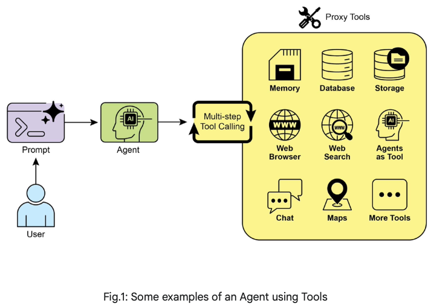

# Introduction
Agentic systems are often characterized by features by **autonomy**, allowing them to act without constant human oversight;
**proactiveness**, initiating actions towards their goals and **reactiveness**, responds effectively to changes in their environment. 
They are fundamentally **goal-oriented**, constantly working towards objectives.\
A critical capability is **tool use**, enabling them to interact with external APIs, databases or services - effectively reaching beyond immediate canvas.\
They possess **memory**, retain information across interactions, and can engage in communication with users, other systems, or even other agents operating on same or connected canvases.

Effectively realizing these characteristics introduces significant complexity. Hence, we need agentic design patterns to breakdown these complexities.

## Why patterns matter in Agentic Development?
> How does the agent maintain state across multiple steps on its canvas?\
> How does it decide when and how to use the tool?\
> How is communication between agents managed?\
> How do you build resilience into system to handle unexpected outcomes or errors?

The complexities above is precisely why agentic design patterns are indispensable. They aren't rigid rules, but rather battle-tested templates
or blueprints that offer proven approaches to standard design and implementation challenges in the agentic domain.\
Using design patterns helps you avoid reinventing fundamental solutions for tasks like managing conversational flow, integrating external capabilities, or coordinating multiple target actions.\
Leveraging these established approaches accelerates your development process, allowing you to focus on unique aspects of your application rather than foundational mechanics of agent behavior. 

### 1. Prompt Chaining Pattern
Prompt chaining, sometimes referred to as Pipeline pattern, represents a powerful paradigm for handling intricate tasks when leveraging LLMs. 
Rather than expecting an LLM to solve a complex problem in single, monolithic step, prompt chaining advocates for divide-and-conquer strategy.\
The core idea is to break down the original, daunting problem into a sequence of smaller, more manageable sub-problems. 
Each sub-problem is addressed via a specially designed prompt and the output generated from one prompt is fed as input to subsequent prompt in the chain. 

- **Limitations of single prompts:** 
  - For multifaceted tasks, using a single, complex prompt for an LLM can be inefficient, causing model to struggle with constraints and instructions, potentially leading to instruction neglect.
  - Leads to **parts of the prompt are overlooked**, **contextual drift** where model loses track of initial context
  - **error propagation** where early errors amplify
  - Prompts which require a longer context window where model gets insufficient information to respond back
  - Hallucinations where cognitive load increases the chance of incorrect information. 
  - **Prompt Chaining**, addresses these challenges by breaking the complex task into focussed, sequential workflow, which significantly improve reliability and control.

Furthermore, prompt chaining is not just about breaking down problems, it also enables the integration of external knowledge and tools. At each step, the LLM can be instructed
to interact with external systems, APIs or databases, enriching its knowledge and abilities beyond its internal training data, allowing them to function not just as isolated modles but more intelligent systems.\
This serves as a foundation technique for building sophisticated AI Agents. These agents can utilize prompt chains to autonomously plan, reason and act in dynamic environments.

**A prompt chain could look like this:**
```text
Prompt1: Extract text content from a given URL or document.
Prompt2: Summarize the cleaned text.
Prompt3: Extract specific entities (e.g. names, dates, locations) from summary of original text. 
Prompt4: Use the entities to search an internal knowledge base. 
Prompt5: Generate final report with summary, entities and search results. 
```

<details>
<summary>Sample Code:</summary>

```
# --- Prompt 1: Extract Information ---
prompt_extract = ChatPromptTemplate.from_template(
  "Extract the technical specifications from the following text:\n\n{text_input}"
)

# --- Prompt 2: Transform to JSON ---
prompt_transform = ChatPromptTemplate.from_template(
  "Transform the following specifications into a JSON object with "
  "'cpu', 'memory', and 'storage' as keys:\n\n{specifications}"
)

# --- Build the Chain using LCEL ---
# The StrOutputParser() converts the LLM's message output to a simple string.
extraction_chain = prompt_extract | llm | StrOutputParser()

# The full chain passes the output of the extraction chain into the 
# 'specifications' variable for the transformation prompt.
full_chain = (
        {"specifications": extraction_chain}
        | prompt_transform
        | llm
        | StrOutputParser()
)

# --- Run the Chain ---
input_text = "The new laptop model features a 3.5 GHz octa-core processor, 16GB of RAM, and a 1TB NVMe SSD."

# Execute the chain with the input text dictionary.
final_result = full_chain.invoke({"text_input": input_text})
```
</details>

### 2. Routing Pattern
Real world agentic systems must often arbitrate between multiple potential actions based on contingent factors, such as state of env, user input, or the outcome of preceding operation. 
This capability of dynamic decision-making i.e. calls specialized functions, tools, or sub-processes, is achieved through a mechanism known as **Routing**. \
Routing introduces a more flexible and context-aware system behavior.

A sophisticated agent using routing could:
> 1. Analyze the user's query
> 2. Route the query based on its intent:
>    - If intent is "check order status", route to sub-agent or tool chain that interacts with order database
>    - If intent is "product information", route to sub-agent or chain that searches the product catalog
>    - If intent is "tech support", escalate to human
>    - If intent is unclear, route to a clarification sub-agent or prompt chain. 

The core component of Routing pattern is the mechanism that performs the evaluation and directs the flow. This can be implemented in several ways:
- **LLM-based Routing**: The model itself can be prompted to analyse the input and output a specific identifier or instruction that indicates the next step or destination.
  > A prompt might ask the LLM to "Analyze the following user query and output only the category: 'Order Status', 'Product Info', 'Technical Support', or 'Other'." \
  > The agentic system then reads this output and directs the workflow accordingly.
- **Embedding-based Routing**: The input query is converted to vector embedding, which is compared to embeddings of different routes or capabilities. The query is route to the route whose embedding is most similar. \
  This is useful for **semantic routing**, where decision is based on meaning if input rather than just keywords. 
- **Rule-based Routing**: This involves using predefined rules or logic (e.g. if-else/switch cases) based on keywords, patterns or structured data extracted from input. 
  This is usually faster than LLM based routing, but is less flexible for handling nuanced or novel inputs. 
- **Machine Learning Model-Based Routing**, it employs a discriminative model, such as a classifier, that has been specifically trained on small corpus of labeled data to perform a routing task. 
  It does share conceptual similarities with embedding-based models, its key characteristic is the supervised fine-tuning process, which adjusts the model's parameters to create a specialized routing function. 



**Use Case:** A "coordinator" that routes user requests to different simulated "sub-agent" handlers based on requests intent (booking, info or unclear)
The system uses a model to classify the request and then delegates it to appropriate handler function via basic delegation pattern.

<details>
<summary>Sample Code:</summary>

```
from langchain_core.prompts import ChatPromptTemplate
from langchain_core.output_parsers import StrOutputParser
from langchain_core.runnables import RunnablePassthrough, RunnableBranch, RunnableLambda

# --- Define Simulated Sub-Agent Handlers ---

def booking_handler(request: str) -> str:
"""Simulates the Booking Agent handling a request."""
print("\n--- DELEGATING TO BOOKING HANDLER ---")
return f"Booking Handler processed request: '{request}'. Result: Simulated booking action."

def info_handler(request: str) -> str:
"""Simulates the Info Agent handling a request."""
print("\n--- DELEGATING TO INFO HANDLER ---")
return f"Info Handler processed request: '{request}'. Result: Simulated information retrieval."

def unclear_handler(request: str) -> str:
"""Handles requests that couldn't be delegated."""
print("\n--- HANDLING UNCLEAR REQUEST ---")
return f"Coordinator could not delegate request: '{request}'. Result: Please clarify."

# --- Define Coordinator Router Chain ---

coordinator_router_prompt = ChatPromptTemplate.from_messages([
("system", """Analyze the user's request and determine which specialist handler should process it.
- If the request is related to booking flights or hotels, output 'booker'.
- For all other general information questions, output 'info'.
- If the request is unclear or doesn't fit either category, output 'unclear'.

ONLY output one word: 'booker', 'info', or 'unclear'."""),
("user", "{request}")
])

# Initialize the router chain
coordinator_router_chain = coordinator_router_prompt | llm | StrOutputParser()

# --- Define the Delegation Logic ---

# Create the RunnableBranch to route based on the router's decision.
delegation_branch = RunnableBranch(
(lambda x: x['decision'].strip() == 'booker', RunnableLambda(lambda x: booking_handler(x['request']['request']))),
(lambda x: x['decision'].strip() == 'info',   RunnableLambda(lambda x: info_handler(x['request']['request']))),
RunnableLambda(lambda x: unclear_handler(x['request']['request'])) # Default
)

# Combine the router and the branch into a single coordinator agent
coordinator_agent = (
{
"decision": coordinator_router_chain,
"request": RunnablePassthrough()
}
| delegation_branch
)

# --- Example Usage ---

def main():
  if not llm:
  print("\nSkipping execution due to LLM initialization failure.")
  return

  print("\n--- Running with a booking request ---")
  req_a = "Book me a flight to London."
  result_a = coordinator_agent.invoke({"request": req_a})
  print(f"Final Result A: {result_a}")

  print("\n--- Running with an info request ---")
  req_b = "What is the capital of Italy?"
  result_b = coordinator_agent.invoke({"request": req_b})
  print(f"Final Result B: {result_b}")

  print("\n--- Running with an unclear request ---")
  req_c = "Tell me about quantum physics."
  result_c = coordinator_agent.invoke({"request": req_c})
  print(f"Final Result C: {result_c}")

if __name__ == "__main__":
main()
```
</details>


### 3. Parallelization Pattern
We have explored **Prompt Chaining** for sequential workflows and **Routing** for dynamic decision-making and transitions between different paths.
While these patterns are essential, many complex agentic tasks involve multiple sub-tasks that can be executed simultaneously rather than one after the other. \
**Parallelization** involves executing multiple components, such as LLM calls, tools usages or even entire sub-agents concurrently. 
Implementing parallelization requires frameworks that support asynchronous execution or multi-threading/multiprocessing. Modern agentic frameworks are designed with asynchronous operations in mind, allowing you to define steps that can run in parallel. 

> [!NOTE]
> Asyncio library provides concurrency, not parallelism. It achieves this on a single thread by using an event loop that switches between tasks when one is idle. 
> This creates the effect of multiple tasks being processed at once, but the code is being executed only on one thread.  

<details>
  <summary>Sample Code: </summary>

  ```
  import asyncio
  from langchain_core.prompts import ChatPromptTemplate
  from langchain_core.output_parsers import StrOutputParser
  from langchain_core.runnables import RunnableParallel, RunnablePassthrough, Runnable
  
  # --- Define Independent Chains ---
  # These three chains represent distinct tasks that can be executed in parallel.
  
  summarize_chain: Runnable = (
      ChatPromptTemplate.from_messages([
          ("system", "Summarize the following topic concisely:"),
          ("user", "{topic}")
      ])
      | llm
      | StrOutputParser()
  )
  
  questions_chain: Runnable = (
      ChatPromptTemplate.from_messages([
          ("system", "Generate three interesting questions about the following topic:"),
          ("user", "{topic}")
      ])
      | llm
      | StrOutputParser()
  )
  
  terms_chain: Runnable = (
      ChatPromptTemplate.from_messages([
          ("system", "Identify 5-10 key terms from the following topic, separated by commas:"),
          ("user", "{topic}")
      ])
      | llm
      | StrOutputParser()
  )
  
  # --- Build the Parallel + Synthesis Chain ---
  
  # 1. Define the block of tasks to run in parallel. 
  # The results of these, along with the original topic, will be fed into the next step.
  map_chain = RunnableParallel(
      {
          "summary": summarize_chain,
          "questions": questions_chain,
          "key_terms": terms_chain,
          "topic": RunnablePassthrough()  # Pass the original topic through
      }
  )
  
  # 2. Define the final synthesis prompt which will combine the parallel results.
  synthesis_prompt = ChatPromptTemplate.from_messages([
      ("system", """Based on the following information:
  Summary: {summary}
  Related Questions: {questions}
  Key Terms: {key_terms}
  
  Synthesize a comprehensive answer."""),
      ("user", "Original topic: {topic}")
  ])
  
  # 3. Construct the full chain
  full_parallel_chain = map_chain | synthesis_prompt | llm | StrOutputParser()
  
  # --- Run the Chain ---
  
  async def run_parallel_example(topic: str) -> None:
      """
      Asynchronously invokes the parallel processing chain with a specific topic.
      """
      if not llm:
          print("LLM not initialized. Cannot run example.")
          return
  
      print(f"\n--- Running Parallel LangChain Example for Topic: '{topic}' ---")
      
      try:
          # The input is passed to each runnable in the map_chain simultaneously.
          response = await full_parallel_chain.ainvoke(topic)
          print("\n--- Final Response ---")
          print(response)
      except Exception as e:
          print(f"\nAn error occurred during chain execution: {e}")
  
  if __name__ == "__main__":
      test_topic = "The history of space exploration"
      # Standard way to run an async function in modern Python
      asyncio.run(run_parallel_example(test_topic))
  ```
</details>

### 4. Reflection Pattern
The Reflection pattern involves an agent evaluating its own work, output or internal state and using that evaluation to improve its performance or refine its response. 
It's a form of self-correction or self-improvement, allowing the agent to iteratively refine its output or adjust approach based on feedback or comparing against desired criteria. 
Reflection can occasionally be facilitated by a separate agent whose specific role is to analyze the output of an initial agent. 

The process typically involves the following stages
- **Execution**, The agent performs a task or generate initial output
- **Evaluation/Critique**, The agent analyzes the results of previous step (often another LLM call or set of rules). This evaluation might check for factual accuracy, coherence, style, completeness or adherence to instructions. 
- **Reflection/Refinement**, Based on the critique, the agent determines how to improve i.e. generate a refined output, adjust parameters for a subsequent step or even modify the overall plan. 
- Iteration (Optional but common), The refined output or adjusted approach can then be executed and the reflection process can repeat until a satisfactory result is achieved or stopping condition is met.

Reflection pattern separates the process into two distinct logical roles: a **Producer** and a **Critic**. This is often called **"Generator-Critic"** or **"Producer-Reviewer"** model.



<details>
  <summary>Sample Code: </summary>

  ```
  from langchain_core.messages import HumanMessage, SystemMessage
  
  def run_reflection_loop():
      """
      Demonstrates a multi-step AI reflection loop to progressively
      improve a Python function.
      """
      # --- The Core Task ---
      task_prompt = """
  Your task is to create a Python function named `calculate_factorial`.
  This function should do the following:
  1. Accept a single integer `n` as input.
  2. Calculate its factorial (n!).
  3. Include a clear docstring explaining what the function does.
  4. Handle edge cases: The factorial of 0 is 1.
  5. Handle invalid input: Raise a ValueError if the input is a negative number.
  """
  
      # --- The Reflection Loop ---
      max_iterations = 3
      current_code = ""
      
      # We build a conversation history to provide context for refinement
      message_history = [HumanMessage(content=task_prompt)]
  
      for i in range(max_iterations):
          print("\n" + "="*25 + f" REFLECTION LOOP: ITERATION {i + 1} " + "="*25)
  
          # --- 1. GENERATE / REFINE STAGE ---
          if i == 0:
              print("\n>>> STAGE 1: GENERATING initial code...")
              response = llm.invoke(message_history)
              current_code = response.content
          else:
              print("\n>>> STAGE 1: REFINING code based on previous critique...")
              # Instruct the model to apply the critiques found in message_history
              message_history.append(HumanMessage(content="Please refine the code using the critiques provided."))
              response = llm.invoke(message_history)
              current_code = response.content
              
          print(f"\n--- Generated Code (v{i + 1}) ---\n{current_code}")
          message_history.append(response) 
  
          # --- 2. REFLECT STAGE ---
          print("\n>>> STAGE 2: REFLECTING on the generated code...")
          
          reflector_messages = [
              SystemMessage(content="""
  You are a senior software engineer and an expert in Python.
  Your role is to perform a meticulous code review. Critically evaluate 
  the code based on requirements. Look for bugs, style issues, and missing edge cases.
  If the code is perfect, respond ONLY with 'CODE IS PERFECT'.
  Otherwise, provide a bulleted list of your critiques.
  """),
              HumanMessage(content=f"Original Task:\n{task_prompt}\n\nCode to Review:\n{current_code}")
          ]
          
          critique_response = llm.invoke(reflector_messages)
          critique = critique_response.content
  
          # --- 3. STOPPING CONDITION ---
          if "CODE IS PERFECT" in critique:
              print("\n--- Critique ---\nNo further critiques found. The code is satisfactory.")
              break
              
          print("\n--- Critique ---\n" + critique)
          
          # Add the critique to the history for the next iteration
          message_history.append(HumanMessage(content=f"Critique of the previous code:\n{critique}"))
  
      print("\n" + "="*30 + " FINAL RESULT " + "="*30)
      print("\nFinal refined code after the reflection process:\n")
      print(current_code)
  
  if __name__ == "__main__":
      run_reflection_loop()
  ```
</details>

#### Practical Applications and Use Cases:
- Creative writing and Content Generation
- Code Generation and Debugging
- Summarization and Information Synthesis
- Conversational Agents

> [!Note]
> The separation of concern is powerful because it prevents the "cognitive bias" of an agent reviewing its own work. The Critic agent approaches the output with fresh perspective, dedicated entirely to finding errors and areas of improvement.
> The benefits of reflection patterns come at cost of increased latency and computational expense, along with higher risk of exceeding model's context window or throttled by API services.
> Full iterative reflection often requires stateful workflows (like LangGraph), a single reflection step can be implemented in LangChain.

### 5. Tool Use Pattern (Function Calling)
Chaining, Routing, Parallelization, Reflection are agentic patterns which primarily involve orchestrating interactions between language models and managing the flow of information within the agent's internal workflow. 
However, for agents to interact with real world or external systems, they need ability to use Tools.\
The Tool Use pattern, often implemented via Function Calling, enables an agent to interact with external APIs, databases, services or even execute code. It allows LLM to decide when and how to use specific tool based on user's request. 

The process involves following steps:
1. **Tool Definition**, External functions or capabilities are defined and described to the LLM. The description includes the function's purpose, its name and the parameters it accepts, along with their types and descriptions. 
2. **LLM Decision**, The LLM received the user's request and the available tools definitions. LLM now decides if calling one of more tools is necessary to fulfill the request. 
3. **Function Call Generation**, If the LLM decides to use a tool, it generates a structured output (JSON Object) that specifies the name of tool to call and arguments to pass to it, extracted from user's request
4. **Tool Execution**, The agentic framework intercepts this structured output, identifies the requested tool and executes the external function with provided arguments. 
5. **Observation/Result**, The output or result from tool execution is returned to the agent. 
6. **LLM Processing**, The LLM receives the tool's output as context and uses it to formulate final response to user or decide on next steps in workflow. 

This pattern is fundamental because it breaks the limitation of LLMs training data and allows it to access upto date information or trigger real world actions. 



<details>
  <summary>Sample Code: </summary>
  
  ```
  ```

</details>