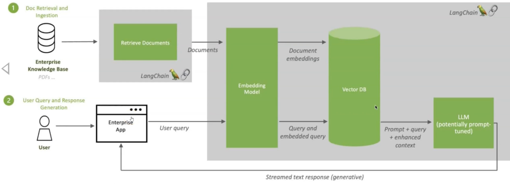

# LangChain & LangGraph and RAG!

### Basics 
1. LLM's essentially are trained in 3 ways
   - **Pre-training**, this is where model has been trained on some 100 TB of data & 70B parameters. Lots GPU power to compress this into gigs, and we hallucinate text out of this. 
   - **Fine-tuning**, To make hallucinations better we do this step. We take the base model and feed it Q&A to help it learn how to respond, less gpu power and maybe 100k examples
   - **Reinforcement** learning, as model responds we let it know if its correct or wrong
2. LLM's have token limits, small models can have token limits of 4k and bigger models have 128,000 token limit.  
   Once the token limit is reached, LLM no longer has context of what was said outside the context window i.e the initial data it was fed is lost. It always remembers the last few tokens. 
3. LLM's context, to give LLM additional knowledge we can do it in 2 ways
   - **In Context Learning**, Here you are directly attaching entire pdf's etc as part of prompt. But for large files we will run out of context window. 
   - **RAG technology**,
     - To do RAG we need to know about **Vector Databases** and **Embedding**
   - We can also do finetuning etc, but the above 2 are most effective.
4. What is RAG?
   - https://blogs.nvidia.com/blog/what-is-retrieval-augmented-generation/
     
   - **Embedding model** converts our content (pdf, csv etc) into tokens. These tokens will be stored as vector embeddings in our vector database. 
     - A vector database is 3d and has lot of space.
     - Vector databases use mathematical metrics (like Euclidean distance, cosine similarity, etc.) to determine the similarity between vectors
     - Based on the similarity metrics, vectors are grouped together, forming clusters of similar data points.
     - Benefits of Clustering
       - **Efficient Search**,  Instead of searching through the entire dataset, queries can be focused on the most relevant clusters, significantly speeding up the search process.
       - **AI Applications**, Vector databases are well-suited for applications like semantic search, recommendation systems, and large language model (LLM) retrieval-augmented generation (RAG).
       - **Understanding Data Context**, Data can be identified based on similarity metrics, allowing AI models to understand data contextually.
   - 
