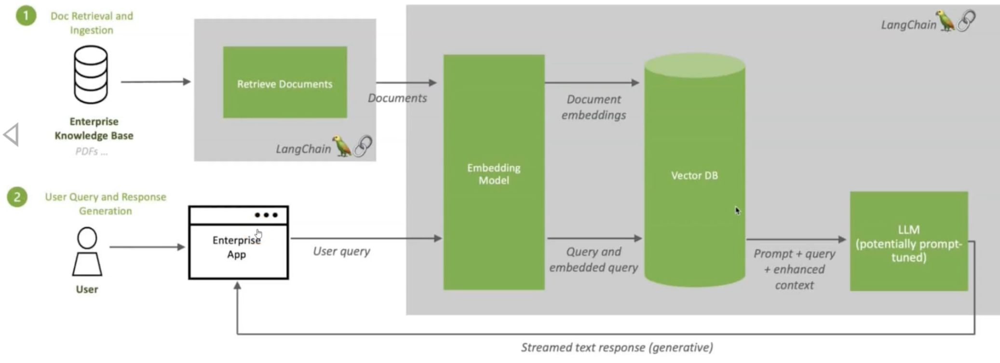
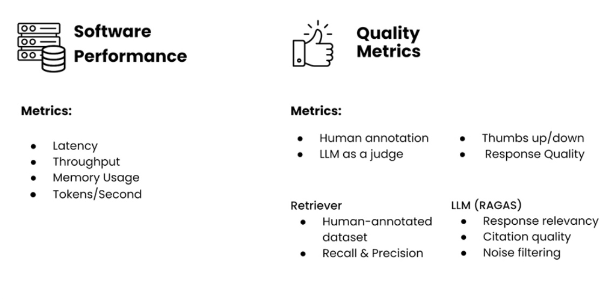
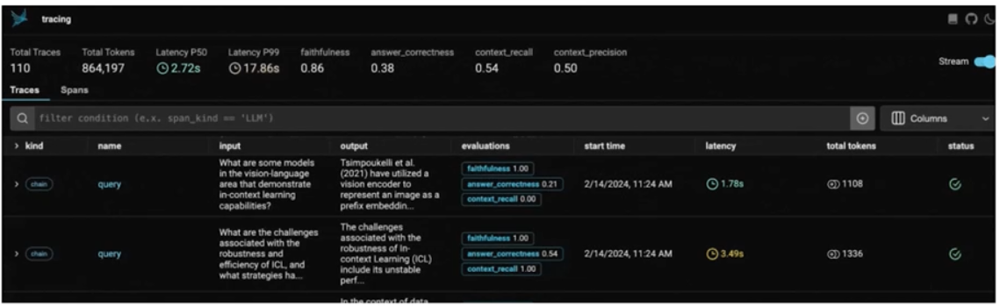

# LangChain & LangGraph and RAG!

### Basics 
1. LLM's essentially are trained in 3 ways
   - **Pre-training**, this is where model has been trained on some 100 TB of data & 70B parameters. Lots GPU power to compress this into gigs, and we hallucinate text out of this. 
   - **Fine-tuning**, To make hallucinations better we do this step. We take the base model and feed it Q&A to help it learn how to respond, less gpu power and maybe 100k examples
   - **Reinforcement** learning, as model responds we let it know if its correct or wrong
   - Its not unfair to say LLM is a fancy autocomplete
   - As words are types an LLM tries to get deep understanding of words and relationship between them, i.e. What a beautiful day, the sun is ?, and calculates the probability of what appears next. 
   - LLM generates probability distribution of all token in its vocabulary and selects most probable token. 
    
   - LLM's are designed to generate "**probable**" text not truthful text. Based on its training there could be knowledge gaps that causes inaccurate responses i.e. hallucinations.
   - LLM is only generating probable word sequences i.e. reproduces statistical patterns from their training data. 
   - This is where RAG comes into picture, it fills the knowledge gaps and give LLM as much relevant info as possible which wasn't part of its training data. This is called "**grounding**" the LLM's response.
2. LLM's have token limits, small models can have token limits of 4k and bigger models have 128,000 token limit.  
   Once the token limit is reached, LLM no longer has context of what was said outside the context window i.e the initial data it was fed is lost. It always remembers the last few tokens. 
3. LLM's context, to give LLM additional knowledge we can do it in 2 ways
   - **In Context Learning**, Here you are directly attaching entire pdf's etc as part of prompt. But for large files we will run out of context window. 
   - **RAG technology**,
     - To do RAG we need to know about **Vector Databases** and **Embedding**
   - We can also do finetuning etc, but the above 2 are most effective.
4. What is RAG?
   - https://blogs.nvidia.com/blog/what-is-retrieval-augmented-generation/
     
   - R(Retrieval) Retrieves data from knowledgebase
   - A(Augmented) Augments the retrieved data to a Prompt before sending it to LLM
   - G(Generation) Performs reasoning and generates response to the end user
   - **Embedding model** converts our content (pdf, csv etc) into tokens. These tokens will be stored as vector embeddings in our vector database. 
     - A vector database is 3d and has lot of space.
     - Vector databases use mathematical metrics (like Euclidean distance, cosine similarity, etc.) to determine the similarity between vectors
     - Based on the similarity metrics, vectors are grouped together, forming clusters of similar data points.
     - Benefits of Clustering
       - **Efficient Search**,  Instead of searching through the entire dataset, queries can be focused on the most relevant clusters, significantly speeding up the search process.
       - **AI Applications**, Vector databases are well-suited for applications like semantic search, recommendation systems, and large language model (LLM) retrieval-augmented generation (RAG).
       - **Understanding Data Context**, Data can be identified based on similarity metrics, allowing AI models to understand data contextually.
5. Advantages of RAG?
   - Injects missing knowledge (Adds info not in training data (e.g. policies, recent headlines etc)
   - Reduces hallucinations
   - Keeps model upto date i.e. reflects new info by updating the knowledge base
   - Enables source citations (We can add in the system prompt to respond by quoting resource links etc from knowledge base)
   - Focuses model on generation rather than retrieval (Retriever does the bulk of work i.e. finding facts and lets LLM focus on responding to user)


### LangChain
1. Core Package, https://python.langchain.com/api_reference/langchain/index.html
    - Integrating with various LLM vendors, i.e from langchain_openai import ChatOpenAI
    - Prompt management & templating, i.e from langchain_core.prompts import PromptTemplate
    - Document Loaders, i.e NotionDirectoryLoader, PyPDFLoader or UnstructuredEmailLoader
    - Agent eco-system, i.e AgentExecutor and various lang-graph implementations
    - Output parsers are very imp to format the LLM output in content field, i.e chain = prompt | llm | StrOutputParser()
    - 

### FlowiseAi setup (https://github.com/FlowiseAI/Flowise)
```javascript
npm install -g flowise or npm update -g flowise
npx flowise start
http://localhost:3000
```
1. Actions in Flowise
   - **Agents**: Supervisor and multiple workers
   - **Marketplace**: **Prompt Engineering Team** is a handy project to clone and use to create prompts for multiple agents. 
   - **Tools**: Serper, Write File, Calculator, Python Interpretor
   - Signup at https://serper.dev/login and get access to serper apis, very handy tool to crawl public websites

### RAG tools
1. **Text splitter** + **Document Loader** (pdf) + **Embeddings model** (text-embedding-ada-002) + In memory vector store or **vector DB** + **Retrieval Tool** + **LLM Worker**
2. **Firecrawl** (https://github.com/mendableai/firecrawl) is an api service that takes a URL, craws it and converts it into clean markdown or structured data.
    It also craws all accessible subpages and gives us clean data without a sitemap. 
    In short it features advanced scraping, crawling, and data extraction capabilities.
3. For text splitters we need to custom select following properties, **chunkSize** and **chunkOverlap**
4. **llamaParse**, Used to convert a PDF to Markdown is better for LLM to read. Also create a summary of markdown if pdf is >100 pages. 
   https://docs.llamaindex.ai/en/v0.10.34/module_guides/loading/connector/llama_parse/  
   An Api Key is also needed from, https://cloud.llamaindex.ai/login
5. **Rapid Apis**, free opensource apis one can use. https://rapidapi.com/
6. **Custom Tool**, Add js function to retrieve data for the worker and connect it as tool to the worker
    Example tools are in marketplace, you can clone Add Hubspot Contact as example
    In js code we can add **Rapid Apis** listed above

### Evaluate LLM's performane in RAG
1. Use of RAGAS library, https://docs.ragas.io/en/stable/
2. Metrics provided by RAGAS library
   - **Response Relevancy**, measures if response is relevant to user prompt, regardless of accuracy
     - Evaluator LLM takes in response to user prompt and generates several sample prompts (Working backwards)
     - Embed original user prompt and sample prompts to vectors and calculate cosine similarity
     - Average similarity scores for final relevancy measure
     - This approach doesn't check accuracy or if response is factual. It checks to see if you can reasonably work backwards from generated response to original user prompt
   - **Faithfulness**, measures if response is accurate 
     - LLM identifies all factual claims in response
     - More LLM calls to determine if claims are factually supported by retrieved information
     - Percentage of supported claims is the faithfulness
3. Other RAGAS metrics capture noise sensitivity, citations etc
4. Other approaches like **Human as Judge**, collect system-wide feedback (thumbds-up/down) and A/B tests to judge LLM performance

### Productionalizing a RAG application
1. Evaluation and Logging - Measure and monitor RAG system performance
2. System Optimization - Balance cost, speed and quality tradeoffs
3. Production challenges
   - Scaling performance
     - **More traffic** increases latency and load
     - **More requests** mean higher memory and compute costs
   - Unpredictability of Prompts, users are creative and unpredictable
   - Security and Privacy
   - Reputation risks on launching an LLM based product
4. How to solve the above challenges -
   - Building a robust observability system
     - Metrics to track include Software performance metrics (latency, throughput, memory)
     - Variety of Quality metrics i.e 
     - Record detailed logs i.e. trace individual prompts through your pipeline and response sent to them
   - System level Evals (end-to-end) vs Component level Evals (parts of RAG system)
     
   - Types of Evals
     - Code-based, recording prompts/sec, unit tests etc
     - Human feedback
     - LLM-as-a-Judge
   - Phoenix is an open-source AI observability platform designed for experimentation, evaluation, and troubleshooting.
     - https://github.com/Arize-ai/phoenix?tab=readme-ov-file
     - Tracing: Trace your LLM application's runtime using OpenTelemetry-based instrumentation.
     
     - Evaluations: Leverage LLMs to benchmark your application's performance using response and retrieval evals.
     
   - Cost vs Response Quality:
     - LLM cost (Inference cost)
       - Use smaller models
       - Limit input and output tokens i.e. smaller prompts, reduce retriever documents(top_K), Use system prompt to set response token limits
       - Figure out best pay model in AWS i.e. per-token pricing or per-hour pricing
     - Vector Database (Storage & query costs)
       - Indexing cost vs inference retrieval documents cost
       - Store HNSW index in RAM for fast retrieval
       - Move rarely accessed vectors to SSD/disk
   - Latency vs Response Quality
     - Most latency comes from transformer i.e LLM 
     - Retriever and vector databases are extremely fast
     - Caching of frequently submitted prompts and responses, use vector databases to match user query with these prompts
     - Monitor other RAG components like re-ranker, query-rewriter etc
     - Search latency can be improved by **Quantized Embeddings**(Use binary/low-bit quantized vectors), **Database Shading**(Split large indexes across instances) etc
   - Security
     - Secure your knowledge base
       - Well worded prompts can cause knowledge base leakage
     - 


### Resources
1. [DeepLearning.ai LLM RAG pdf's](https://community.deeplearning.ai/t/rag-lecture-notes/852809)
2. [RAG Evaluation Metrics  Explained](https://medium.com/@med.el.harchaoui/rag-evaluation-metrics-explained-a-complete-guide-dbd7a3b571a8)
3. Phoenix, opensource AI observability platform, https://github.com/Arize-ai/phoenix?tab=readme-ov-file
4. 
