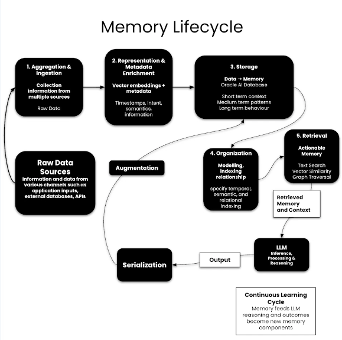
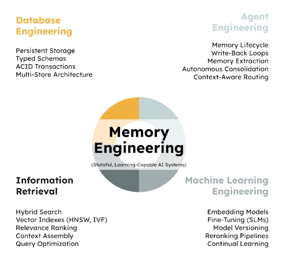
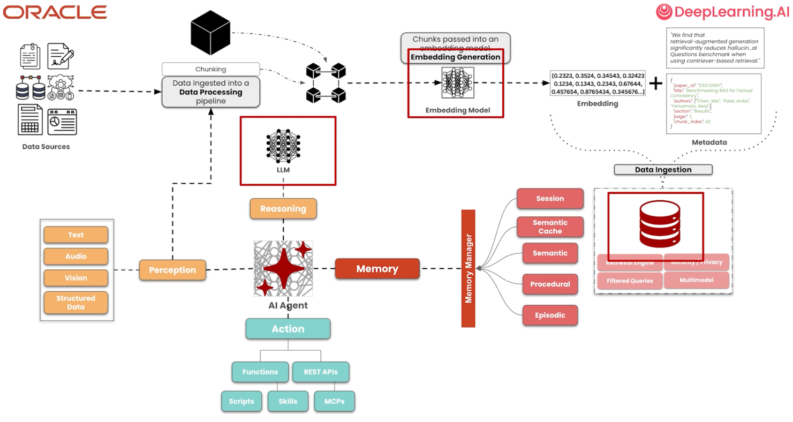
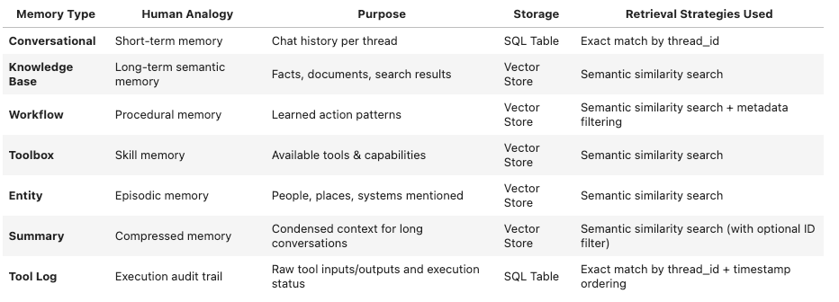
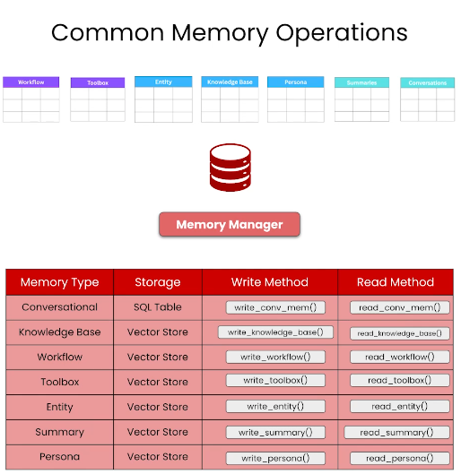
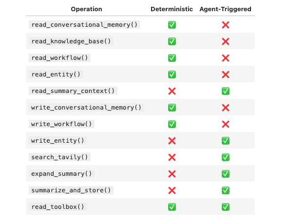
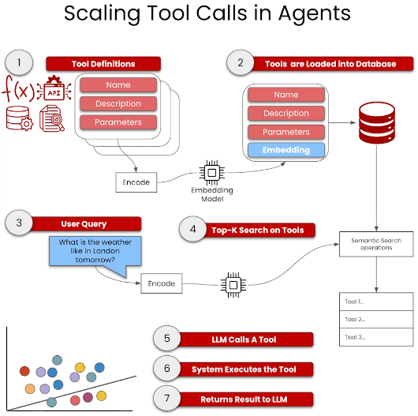
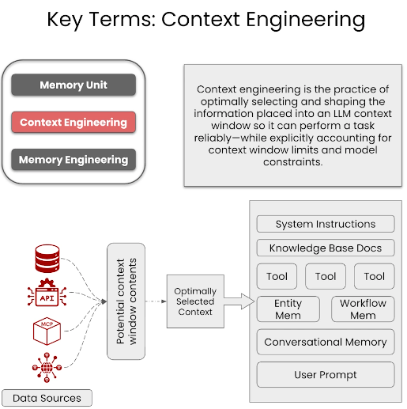

# Building Memory Aware Agents

**AI Agents memory lifecycle**

**Memory Engineering** broadly consists of following principles - Data Engineering, Agent Engineering, ML Engineering & Information Retrieval

## Agent
- An AI agent is a computational entity that has the following capabilities
  - **Perception**, perceives its environment through inputs
  - **Reasoning**, reasons and plans using an LLM as its cognitive engine
  - **Action**, takes actions via tools and integrations
  - **Memory**, augmented with persistent memory to store, retrieve and apply knowledge across interactions

## Stateless Agents
- Stateless agent can perceive inputs, reason and produce actions or outputs but cannot retain or recall information beyond single interaction.
- Disadvantages of stateless agents
  - Cannot perform Long-Horizon tasks
  - No Context awareness across sessions
  - No Learning or Adaptation abilities, i.e. any new information provided during current interactions cannot be used in future interactions
  - High Operations costs, since we have to do a lot of Context Stuffing i.e. pass all past interaction data for every interaction 

## Memory Augments Agents
- Memory augment agents store and retrieve memory into a database about user interactions
- Advantages of memory agents
  - Supports Long-Horizon tasks
  - Sustained context awareness across sessions
  - Improved efficiency and Reduced operational cost
  - Greater reliability in Multi Step workflow

## Agent Memory
Agent memory enables an AI Agent to persistently store, organize, retrieve and reuse information across time, interactions and execution contexts.
This ensures temporal and contextual continuity, even across fragmented interactions.
- Types of Agent memory
  - Short Term memory
    - **Semantic Cache**, caching mechanism that leverages vector search and previous received responses from an LLM to essentially use as response for similar queries in subsequent interactions.
    - **Working Memory**, scratchpad for LLM which is lost after an interaction or session.
      - **LLM Context window**
      - **Session Based**
  - Long Term memory
    - **Procedural**, we store steps and interactions that an agent has taken to achieve its goal, i.e. tools calls and other interactions.
      It's ideal to record the steps in form of external memory which can be referenced and pulled in subsequent interactions.
      - Workflow memory
      - Toolbox memory
    - **Semantic**, this is knowledge base or any external domain specific knowledge that agent needs to compute the task.
      - Entity Memory
      - Knowledge Base
      - Persona
    - **Episodic**, this is a form of conversational memory where attributes are stored based on their timestamp.
      - Summaries
      - Conversational

In an agentic system, there are three main components where memory is located:
  - In our LLM which has **parametric memory** i.e. all the data it has been trained with.
  - Embedding model, which has memory by which it could draw semantic and context information from when generating an embedding
  - Database, most traffic in our agentic system 

## Agent Memory Core
This is the primary database of an agentic system responsible for managing the complete lifecycle of agent memory.
This database layer handles persistent storage, efficient retrieval and memory operations that enables agents to adapt to new information, learn from interactions and maintain consistent performance across sessions.

## Memory Core & Memory Manager & Memory Operations
- Memory Core & Memory Manager combined give AI Agents memory-augmented behavior

- Classification of Memory operations in Agentic Systems
  - **Deterministic** (executed automatically by code)
    - Operations are run under **explicit, fixed conditions** e.g. "always at start of agent loop" or "always after tool execution"
    - **Advantages of deterministic Retrieval**:
      - **Context bootstrapping**
        - agent needs prior context to remain consistent and avoid repeatable mistakes
        - Without deterministic retrieval agent is stateless and starts from scratch
      - The agent can't choose to look up what it does not know exists
      - **Predictability**, always loading memory produces consistent behavior and makes the system easier to evaluate and debug
      - Reliability, Completeness, Reduced congnitive load (model should focus on task execution and not memory bookkeeping)
  - **Agent Triggered** (decided by LLM at runtime)
    - Operations that run only when model decides it's necessary, based on intent and situation
    - Not everything deserves long-term storage, the agent can distinguish signal from noise
    - **Cost and latency control** (Deep retrieval, reranking, summarization and consolidation cost tokens/time). Trigger only when needed to reduce overhead.
    - Higher-quality memory management
      - Decisions about what to store and how to compress requires semantic understanding of intent
      - THe model is well suited to decided when a memory action is worthwhile
    - **Advantages of Agent-Triggered Memory Ops**:
      - Higher signal-to-noise memory
      - Reduced memory bloat
      - Selective compute usage (summarize, expand, retrieve only when valuable)
    - External Tool Call's are Agent triggered as well as judgement is needed based on User Query. 

## Scaling Agent Tool Use with Semantic Tool Memory
As your AI System grows we may have hundreds of tools available - APIs, database queries, calculators, search engines and more. 
Passing all tools to LLM at inference time creates serious problems:
  - **Context bloat**, Tool definition consumes tokens, leaving less room for actual content
  - **Tool selection failure**, LLM struggles to choose right tool when presented with too many options
  - **Increased latency**, more tokens = slower inference
  - **Higher cost**
OpenAI and Anthropic typically recommend limiting number of tools exposed to an LLM (often 10-20 max for reliable selection)

One of the ways to solve this problem is using **Toolbox pattern**.
- Toolbox pattern uses tools as retrievable resources.
- Using Embeddings + Semantic search to select the relevant Top-K tools per request

- **Semantic Tool Retrieval pattern**
  The Toolbox class solves this by treating tools as **searchable memory**.
  1. **Register hundreds of tools** - Store all available tools with their descriptions and embeddings
  2. **Retrieve only relevant tools** - At inference time, use vector search to find tools semantically relevant to current query
  3. **Pass filtered tools to LLM** - Only the retrieved tools are passed to LLM

## How to enable AI Agents to manage long-running conversations effectively?
As conversations grow, a lot of valuable context of LLM is consumed, without proper memory management agents lose historical context or fail due to token limits
Following memory operations need to be done to solve this problem - **Extraction -> Consolidation -> Self-Updating memory**
1. Monitor context window utilization and detect when summarization is needed. 
2. Extract and consolidate conversation history into structured summaries
3. Implement self updating memory that preserves technical details, emotional context and entity information
4. Build tools to allow agents to expand summaries back to original conversations when needed

| Index | Key Concepts | Description |
| :--- | :--- | :--- |
| 1 | **Context Window Management** | Tracking token usage to prevent overflow and trigger timely summarization |
| 2 | **Memory Consolidation** | Compressing verbose conversations into structured summaries while preserving critical information |
| 3 | **Summary Expansion** | Retrieving original conversation content from summary references when detail is needed |
| 4 | **Self-Updating Memory** | Automatic marking of summarized messages to prevent re-processing |

## Useful Patterns
- Context Engineering, Maximising value of each token passed to LLM context, we want to have high signal/noise ratio for single token passed into LLM via various data sources.

- 
