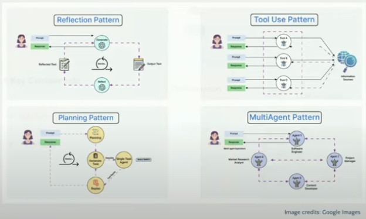

# Agentic AI
Decoding Ai Agents and their capabilities.

### Journey of Automation


### Key points
1. An AI Agent is an application or function that can essentially plan and take action (Apis/tools)
2. Data + Models (Reasoning i.e GPT) + Memory + Tools/Apis + Infra = AI Agents 
3. Rule Based vs AI Automation vs AI Agent
    ```text
   RuleBased - Auto-reply OOO to all emails
   AI Automation - Using Ai models like gemini etc to understand keywords/Context, provide relevant responses.
   AI Agent - Understand the intent, plan and send personalized responses + takes action! i.e in the email example an AI Agent understand what the ask is,
              performs a task i.e aggregate data and send as requested while you are OOO.```
4. Key Components of an AI Agent 
   - Orchestration
   - Models (LLMs)
   - Tools
   - Memory

    

### Architecture Patterns
- **Reflection Pattern**, feedback loop or reinforcement learning i.e self correction constantly to optimise the future.
- **Planning Pattern**, chain of thought prompting. Takes a structured approach i.e breakdown into multiple subtasks comes up with a plan and completes the task. 
- **Tool Use Pattern**, invokes tools/apis to complete the pattern
- **MultiAgent Pattern**, running multiple agents to complete the task
    


### References
- [AICamp](https://www.youtube.com/@AICamp)
- [NirDiamant Github: GenAi_Agents](https://github.com/NirDiamant/GenAI_Agents)
  - [AI News Agent v1](https://medium.com/@nirdiamant21/stop-reading-start-understanding-your-ai-news-agent-simplified-9845e69a86c6)
  - [News TL;DR](https://github.com/NirDiamant/GenAI_Agents/blob/main/all_agents_tutorials/news_tldr_langgraph.ipynb)
  - [Building First AI Agent] (https://diamantai.substack.com/p/your-first-ai-agent-simpler-than)
- [AI News Agent v2](https://github.com/vatsalsaglani/GenAINewsAgent)
- 
