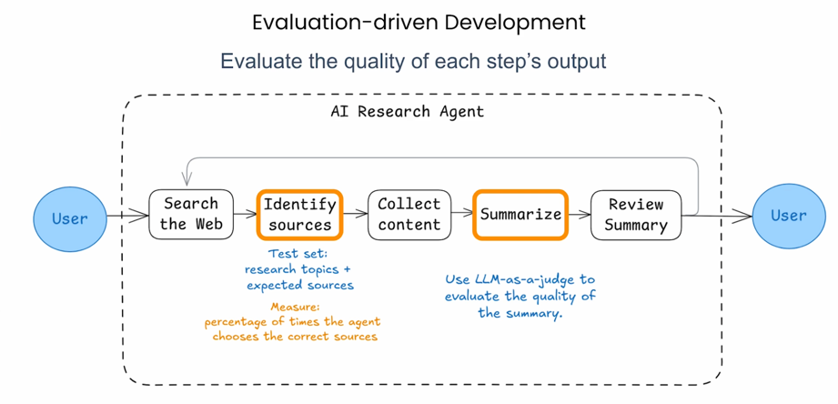
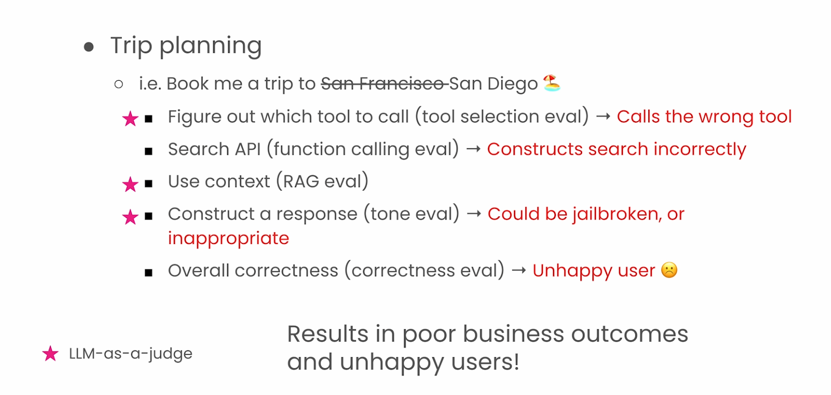
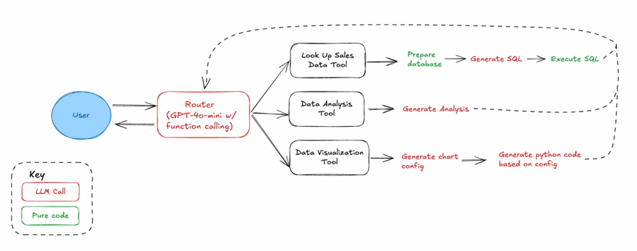
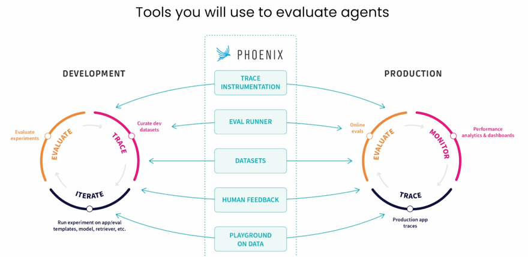

# Evaluations

## Intro to Evals
- We should structure our Evaluations to iterate on and improve both the **output quality** and **path taken** by our agent. 

- **Broad category of Evaluations**:  
  - **LLM Model Evaluation**
    - Measures the general language understanding of a foundation model
    - Benchmark Datasets --> LLM
    - Example of Benchmark Datasets: 
      - **MMLU** (Mulitple choice questions covering math, philosophy, medicine...)
      - **HumanEval** (code generation)
  - **LLM System Evaluation**
    - Evaluate how well the entire application including the LLM performs for the specific application
    - Testing Datasets --> LLM
    - Testing datasets can be manually created, synthesized or curated i.e. real world data
- When testing an LLM based system we need to test the entire eco-system which includes **LLM | Prompt | Tools | Memory | Data sources**
- **Common types of Evaluations for LLM System**:
  - **Hallucinations**, Is LLM accurately providing context or making things up?
  - **Retrieval relevance**, Are the retrieved documents or context relevant to user query?
  - **Q&A on retrieved data**, Does the response match ground truth the user needs?
  - **Toxicity**, Is LLM outputting harmful or undesirable language?
  - **Summarization performance**
  - **Code writing correctness and readability**
- Evals for Agents:
  - What are Agents? Agents are software based systems that can take actions on behalf of user utilizing reasoning
  - 3 Main components of an Agent:
    - **Reasoning**, powered by AI (LLM)
    - **Routing**, interpreting request and determining the correct tool
      - The main planner of the agent
      - Can take the form of LLM, an NLP classifier or even rule-based code
      - Some agents distribute the router logic though out the agent, instead of having a single router unit. 
      - E.g. of distributed routers are LangGraph, OpenAi Swarm etc which offer deep control for complex, stateful agent workflows with graph based orchestraction.
    - **Action/Skills**, executing code/tools (creating requests, utilizing APIs, making LLM calls)
      - E.g. **RAG Skill**, i.e (Embed Input Query) <-> (Vector DB Lookup) <-> (LLM call w/retrieved context)
    - Similarly, we can also think of Agents as having 1. **Router** 2. **Skills (tools)** 3. **Memory and State**
    - Memory and State, is shared state that can be accessed by each component in the agent. Used to Store
        - Retrieved Context
        - Configuration variables
        - Previous agent execution steps, Many LLM Apis rely on receiving each agent step to decide on the next step
  - Agents use cases:
    - Personal Assistants, that help take notes and transcribe information for us
    - Desktop or Browser Agents, that help automate repetitive tasks
    - Automated scraping and summarization
    - Research Assistant
  - Example of Evals for a **Trip Planning Agent** 
  

### Data Analysis Agent
**Use case:** a data analysis assistant that can help us understand sales data from each of our stores
**Skills:**
  - Data lookup skill to query from database
  - Data analysis skill to draw conclusions from data
  - Data visualization skill to generate graphs and visualizations about data
  

> [!NOTE] 
> **Evaluation Metrics:**
> 1. **Ground Truth**, metric which show how far away the output is from reference output
> 2. **Correctness**, whether the answer meaning is consistent with a supplied reference answer. Uses a scale of 1 to 5, 5 being best.
> 3. **Helpfulness**, whether the response answers the given query, scale of 1 to 5, 5 being best 
> 4. **String Similarity**, How close answer is to the reference answer, measured character-by-character [edit distance]. Returns score between 0 and 1
> 5. **Categorization**, whether the answer is exact match with reference answer. Return score of 0 or 1
> 6. **Tools Used**, whether the execution used tools to not, Return a score between 0 and 1.
> 7. Custom Metrics:
>    1. **RAG document relevance**, when working with vector databases, whether the document retrieved are relevant to the question. 
>    2. 

## Tools used to Evaluate Agents
- **Trace Instrumentation**, Used to understand what's happening with our agent underneath the hood
- **Eval Runner**, which contains LLM as judge
- **Data Sets**, which can be used to rerun experiments
- **Human Feedback**, to capture human annotations
- **Prompt Playground**, used to iterate on your data to get expected results

## Resources
- https://docs.n8n.io/advanced-ai/evaluations/overview/
- 