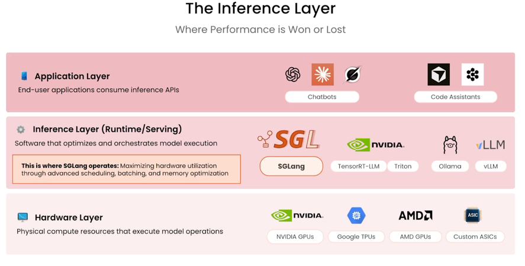
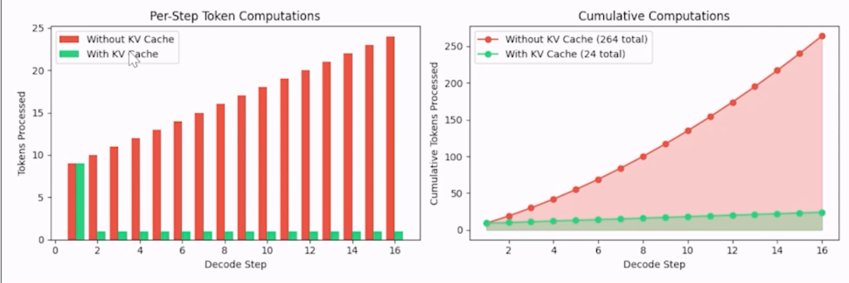
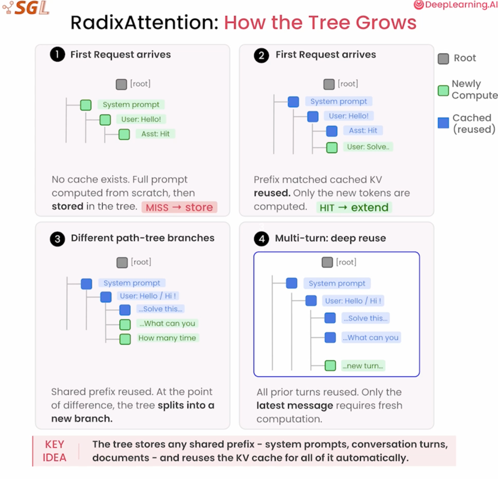
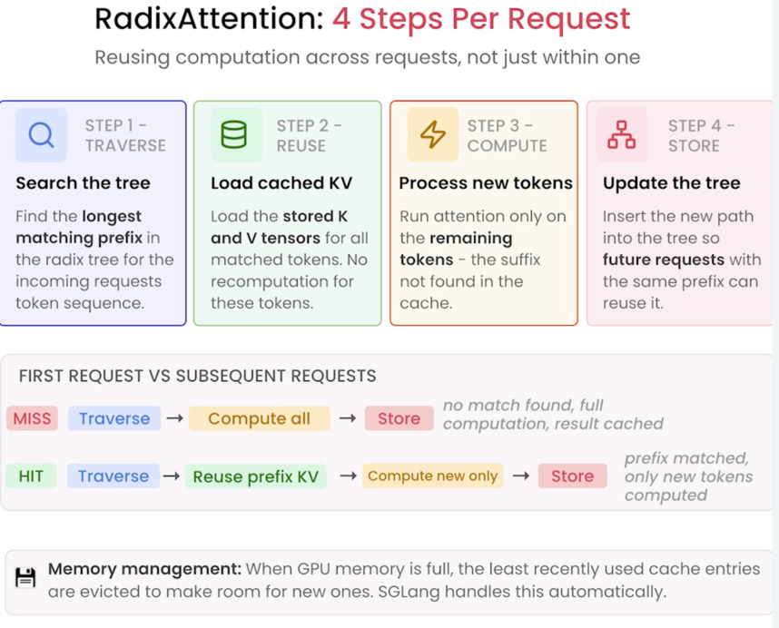

# Introduction SGLang
- SGLang is an opensource framework very similar to Prompt caching provided by Anthropic for its models. 
- SGLang is used to perform memory management for local models vs Prompt Caching via <cache-control> by Anthropic is proprietary for Claude models. 
- How to make inference fast, scalable and efficient using SGLang? 
- It's a high performance serving framework for LLM's to deliver low latency and high throughput inference across wide range of setups.

- **The latency vs throughput tradeoff?** During inference time with LLMs, how do we serve AI models faster, cheaper and at scale?
    - <ins>**KV Cache** and **Continuous Batching**</ins> gets us better latency along with better throughput.
- What does **Autoregressive nature of LLM Inference** mean?
  - The generation of tokens by LLM based on previous tokens (probability distribution) is **sequential, one-at-a time process** i.e. we can't skip to 10th token in the sentence "The Sky is ......" without sequentially generating the 9 tokens before it. 
  - If you need 100 tokens, its 100 sequential forward passes.
  - Memory grows with every token as we are holding all previous tokens to generate the new token
  - **Harder to scale than training**, coz training can be scaled across multiple parallel gpus but Autoregression is inherently sequential so we can't throw multiple gpus at a single request.
  - KV Cache helps us store previous tokens and avoid 

- SGLang Optimizes for Autoregressive models. The three pillars that make SGLang prod ready are 
  - **Fast runtime**, built for high throughput and low latency with smart scheduling with memory re-use at its core. 
    - Radix Attention
    - Prefix Caching
    - Speculative Decode
    - Quantization
    - Continuous Batching
  - **Broad Model Support**
    - Runs language, embedding, reward and diffusion models compatible with HuggingFace etc
    - E.g. Llama, Qwen, DeepSeek, Gemma, Diffusion, OpenAI API
  - **Extensive Hardware support**, deployed on major accelerators from NVIDIA's latest Blackwell GPUs to AMD, Intel and Google TPUs.

## Attention Mechanism
- An attention mechanism is a machine learning technique that directs deep learning models to prioritize the most important parts of input data. 
- Innovation in attention mechanisms enabled the transformer architecture which gave birth to modern LLMs like ChatGPT and Anthropic models. 
- Attention mechanisms are inspired by ability of humans to selectively pay more attention to salient details and ignore details that are less important in the moment. 
- Having access to all information but focusing on only the most relevant information helps to ensure that no meaningful details are lost while enabling efficient use of limited memory and time. 
- An attention model - an AI Model that employs an attention mechanism - is trained to assign accurate attention weights through supervised learning or self-supervised learning on large dataset of examples.
- While attention mechanisms are primarily associated with LLMs used for natural language processing(NLP) tasks, such as summarization, Q&A, text generation and sentiment analysis, attention based models are also widely used in other domains. 
- Leading diffusion models used for image generation often incorporate an attention mechanism. In field of computer vision, vision transformers(ViTs) have achieved superior results on tasks including object detection, image segmentation and visual q&a. 
- In Token generation every token produces 3 vectors (**Q, K, V** similar to database)-
  - **Query vector**, represents the information a given token is seeking. What am I looking for? (The current token asking a question to all previous tokens)
  - **Key vector**, represents information each token contains.  
    - Every token in the sequence provides a key that describes its content, helping the query determine relevance
    - Alignment between query and key is used to compute attention weights
  - **Value**, applies the attention weighted information from the key vectors
    - Contributions from keys that are strongly aligned with query are weighted more heavily
    - Contributions from keys that are not relevant to query will be weighted closer to zero.
  - For example, "The sky is ", the next token blue/black, the next token calculates its relevancy to all the other token and an attention weighted score is computed. 
  - KV Cache, **K & V for each token are computed only once and reused every subsequent step**, stores these attentions weights instead of recomputing every step.
  - 
## KV Cache
- The growing memory cost during Autoregression is addressed by KV Cache. 
- <ins>**Step1: Prefill**</ins>
  - Build the cache
  - Process the full prompt in parallel. Compute and store K, V for every input token. Run once before generation begins
- <ins>**Step2: Decode**</ins>
  - Reuse the cache
  - Generate one token at a time, only the new token needs computation - all prior K,V are read from memory
- KV Cache cuts computational work from quadratic to linear i.e. **O(n2) to O(n)**
  
- Without KV Cache every new token forces a recompute of all previous KV and results in memory growing exponentially with output length
- KV Cache Optimization results in fast inference as scale

## Prefix Caching with RadixAttention
- Cached computations across multiple requests using SGLang's Radix Attention. 
- SGLang uses RadixAttention, which manages KV caches in a tree structure, allowing it to cache common prefixes across multiple different requests automatically.
- KV cache is great for single request, i.e. cache lives and dies with a single request. The moment it finishes cache is thrown away. 
- What about a RAG application which has same document in front of every question? or Chatbot that has same system prompt for every user? 
- For each request we have to independently compute identical KV tensors for these shares tokens. Identical KV tensors are computed and discarded on every request - **prefix caching eliminates this inefficiency**.
- As multiple requests share the same **prefix - document, system prompt or conversation history, compute it once and reuse the KV cache** for everyone.
- RadixTree -> How does it grow?
  1. (Request 1) Model computes KV tensors for entire prompt from scratch and inserts results in tree (Cache Miss -> Store)
  2. (Request 2) Prefix matched cached KV reused. Only new tokens are computed (HIT -> extend)
  3. Different path - tree branches, Shared prefix reused. At the point of difference the tree splits into a new branch. 
  4. Multi turn - deep reuse, all prior turns reused, only the latest message requires fresh computation
    

## RadixAttention Algorithm Steps
1. **Traverse**, Checks how much of incoming tokens already exists
2. **Reuse**, If match is found load stored K&V tensors into LLMs KV Cache. 
3. **Compute**, run the attention only on new tokens
4. **Store**, insert newly computed KV tensors into the tree to benefit future requests.

