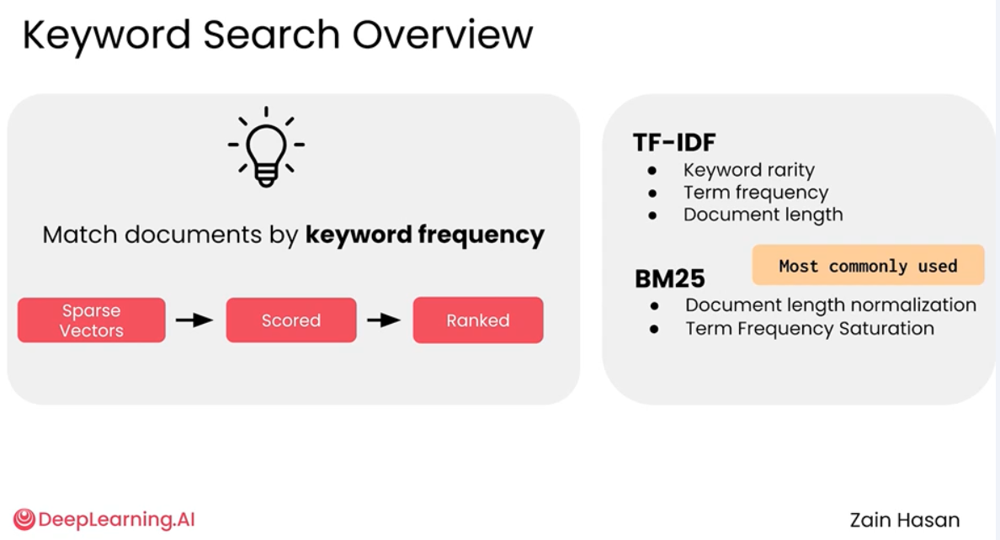
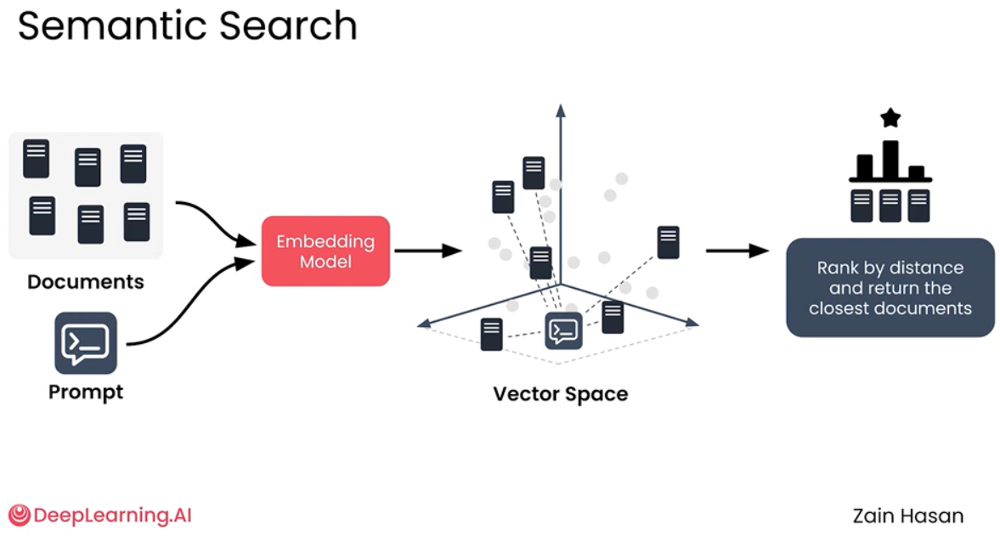
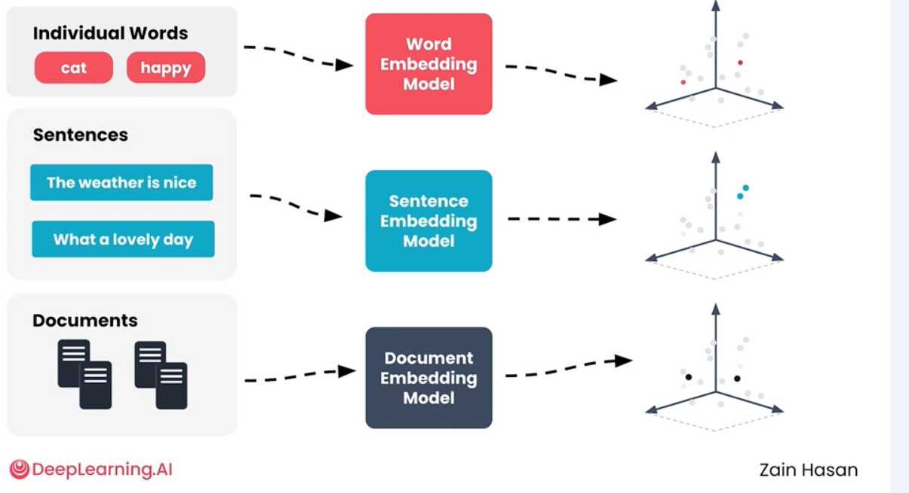
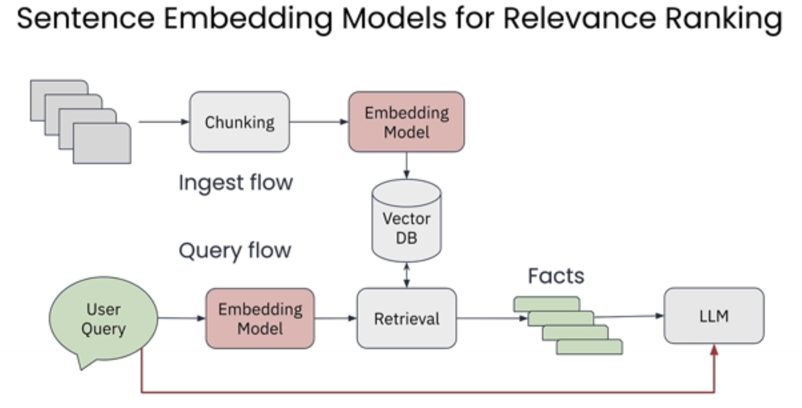
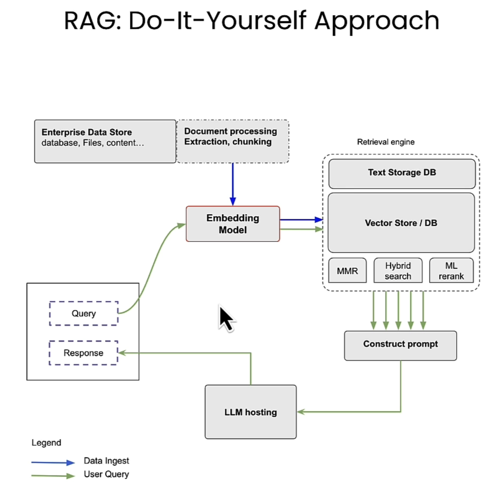
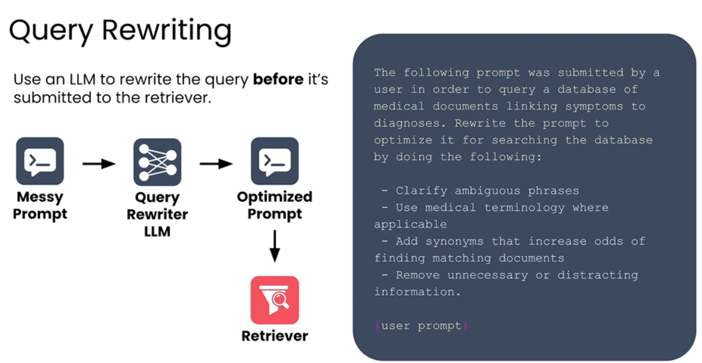
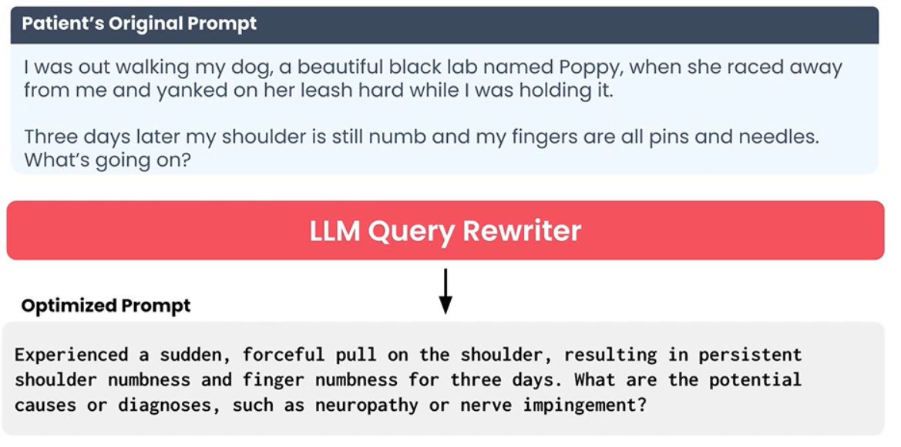
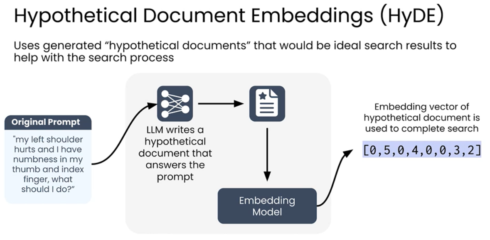
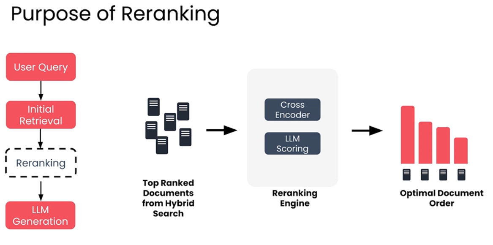

# Vector DB

Vector databases use embeddings to capture the meaning of data, gauge the similarity between different pairs of vectors, and navigate large datasets to identify the most similar vectors. 
In the context of large language models, the primary use of vector databases is retrieval augmented generation (RAG), where text embeddings are stored and retrieved for specific queries.
However, the versatility of vector databases extends beyond RAG and makes it possible to build a wide range of applications quickly with minimal coding.

**Designed for Vector Search** - Designed to store high dimensional vectors and perform vector searching using ANN algorithms.
**Outperform Relational Databases**
**Optimized for ANN search** - Designed to build HNSW indexes and compute vector distances. Scale well and operate quickly

### Main applications of Vector Databases
1. **Semantic Search**: Search that goes beyond keyword matching, focussing on meaning of content/context of user query. 
2. **RAG**
3. **Recommender System**
4. **Facial Similarity**
5. **Anomaly Detection**: e.g identify unusual patterns in logs

### Keyword Search
- Inverted data index also called Sparse vectors are created on document Indexing. 
- TF-IDF (Term Frequency, Inverted Document Frequency) to score relevancy of each document. Calculated by multiplying the TF and IDF values for a given term in a specific document.
- BM25, Best Matching 25. Uses IDF & RF score and optimizes it further to get better relevancy score
  - Couple of issues with TF-IDF this algo addresses a. **Term frequency Saturation** b. **Document Length Normalization**

  
### Semantic Search
- Semantic search not just matches the word but captures the meaning of it and/or deeper meaning of a phrase and matches synonyms 
- Keyword search will treat "python" the programming language, "python" the snake the same, but using Semantic search we know these phrase have different meanings based on context in which they are used.
- **Semantic Search vs Keyword Search**
  - Prompt and documents each get a vector i.e. sparse vector (Keyword Search) Dense vector (Semantic Search)
  - Vectors compared to generate scores
  - The main difference is how vectors are assigned
    - Keyword Search: count words
    - Semantic Search: use embedding model

- Embedding models 
  - Word Embedding models
  - Sentence Embedding models
  - Document Embedding models

### Semantic Search high level architecture patterns:
  - **Bi-encoders**, reasonably good quality great speed, minimal storage and is used as default pattern
  - **Cross-encoders**, best quality extremely slow, minimal storage since prompt + document is sent real time and vectors aren't computed ahead of time
  - **ColBERT**, nearly the quality of cross-encoder, decent speed, but significant vector storage

### What are Embeddings?
- A type of data compression which transforms messy data (text, images, audio video etc) into compact format for ML algorithms
- Most often numeric vectors(aka arrays) with 100s or 1000s of elements
- Preserve information such that "similar" items have proportionally "similar" embedding vectors
- Similarity is measured with vector algorithms (cosine, euclidean, etc)
- Euclidean Distance
  - Measure how far apart two vectors are by drawing a straight line between them, find shortest distance. 
- Cosine similarity,
  - In high dimensional vectors, euclidean distance may not give the correct result as every vector may be far away from similar vectors when plotted
  - In this case we look at similarity in direction of 2 vectors i.e. angle between them to figure out how close they are
  - (-1) Opposite direction (0) Perpendicular (1) Same direction
- What does similarity mean?
  - If it's a **Text Embedding**, Semantic similarity i.e meaning behind sequence of texts
  - If it`s a **Graph Embeddings**, similarity in position or structure in a graph - can have semantic meaning too

### Embedding Models
- Embedding models have evolved from word to sentence embeddings to now cross encoder embedding models.
- Embedding models create embedding vectors that make it possible to build semantic or meaning based retrieval systems.

- Word Embeddings vs Contextualized word embeddings:
  - If a word is simply vectorized, then words with different context get the same vector embeddings. This isn't what we want to do semantic search coz context is lost. 
  - **Contextualized word embeddings** to the rescue. In 2017 introduced **Transformer architecture** which led to creation of LLM's today and also solved issue of contextualized word embeddings.
- Bert Embedding Model common tasks
  - **Text classification**
  - **Named Entity Recognition** (Detecting PII data etc)
  - **Question Answering**
- How do we go from contextualized word embeddings to a full sentence embedding model? (for much greater accuracy)
  - Use **dual encoder architecture** for sentence embeddings
  - Its mostly used to train on Q&A pairs
- RAG: Workflow
  
- Why not add everything in context window to RAG?
  - Higher computational cost
    - Longer prompts take more computation to run
    - Model now has to scan every token and perform complex scans
  - Context window limit
    - Eventually you will hit hte limit of LLM's context window
    - Small models have only thousand token while larger models have millions of tokens as context window

### Vector Retrieval Algorithms
- KNN (K Nearest Neighbours)
  - Create vector embeddings for all documents in your knowledge base
  - Create vector embedding of prompt
  - Compute distance between prompt vector and every other indexed vector
  - Sort by distance, return closest K documents
  - Potential Problems
    - Scaling is an issue, O(n), i.e. as number of documents in index increase our number of distance calculations grows linearly
    - To solve the above we use ANN (Approximate Nearest Neighbors)
- ANN (Approximate Nearest Neighbours)
  - Significantly faster than KNN
  - These new set of algorithms use clever data structures to enable faster searches
  - Not guaranteed to find absolute closest documents, but retrieval is much faster on large datasets
  - Creates proximity graphs, similar to graph traversal, and using this smaller subset finds vector closest to the prompt vector
- HNSW (Hierarchical Navigable Small World)
  - Speeds up early parts of search
  - Relies on hierarchical proximity graph, creates multi layer graphs and traverses through these layers to find candidates.
  - Each layer graph has smaller vector subsets than one before it. Hence this scales at O(log n) than O(n) for KNN

### Vector Database Operations
- Database setup
- Load Documents i.e. index documents
- Create sparse vectors for keyword search
- Create dense vectors for semantic search
- Create HNSW index to power ANN algorithm
- Run searches!

### Techniques to optimize use of Vector Databases
#### Chunking
  - **Balancing Chunk Size**
    - If too Large, too many topics in one vector and they fill LLM context window quickly
    - If too Small, loss of surrounding context and reduces search relevancy
    - Figure out optimal chunk size, usually 500 ~ 1000 and add overlapping ~ 25 to not cut chunks without getting surrounding context
  - **Recursive Character Splitting**
    - Splitting text into chunks at specified character i.e. newlines to capture each paragraph as single chunk
- Advanced Chunking techniques
  - **Semantic Chunking**
    - In order to not lose context when data is chunked we first vectorize a chunk and compare with next chunk. If they are similar we don't split.
    - Only create a new chunk when similarity threshold has been crossed i.e. the next chunks contains different context
    - Pros
      - Follows authors train of thought
      - Smarter chunk boundaries
      - Higher recall and precision
    - Cons
      - Chunking is computationally expensive
      - Requires repeated vector calculation
  - **LLM based chunking**, Use LLMs to do the chunking by giving instructions via prompts
  - **Context aware chunking**, Work with LLM to not just chunk data but also add context to each chunk like summary etc

#### Query Parsing
  - Cleanup user prompts as they aren't most suitable for vector search. Have a process to edit or even rewrite the prompt before its sent to retriever to get most optimal data from knowledge base
  - Techniques:
    - Query Rewriting, use an LLM to rewrite the query before its submitted to the retriever
      
      
    - Named Entity Recognition
      - Add context to your prompt, i.e. tag data in prompt as Location, Date, Book etc and this added context in the prompt will be used by retriever to get more relevant data
      - GLINER model is a good example
    - Hypothetical Document Embeddings (HyDE)
      - Use an LLM to generate hypothetical document that answers the prompt
      - Use the vector embedding of this document to retrieve documents closest to it in Knowledge base
      
      - HyDE means the retrieve is matching documents to documents, one is the **perfect** hypothetical one generated from the prompt

#### Reranking
  - Reranking engine re-scores the most relevant K documents retrieved. Usually a Cross Encoder is used. 
  - Add this process to search pipeline to optimize rank of documents of retriever
  

